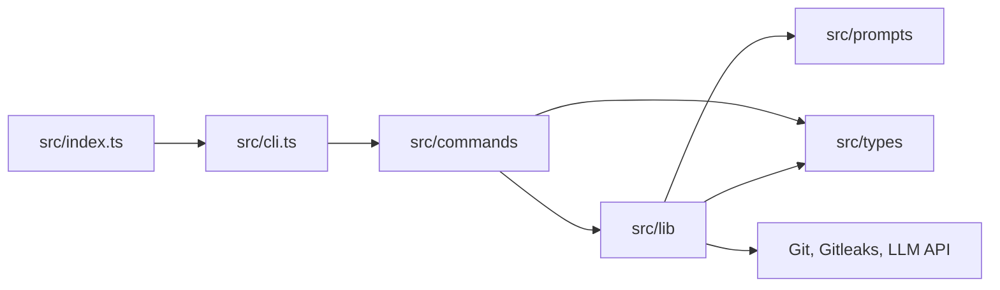

# zapdev

## Project Introduction

**zapdev** is a lightweight TypeScript CLI that makes small, repetitive Git chores fast and precise.

It stages changes, scans them for secrets, generates Conventional Commit messages with an OpenAI-compatible LLM endpoint, and streamlines repository cleanup.

## Project Architecture



- `src/index.ts`: bin launcher; enables the V8 compile cache, then loads `cli.js`.
- `src/cli.ts`: CLI entry; registers subcommands and opens the interactive menu.
- `src/commands/`: command UI and orchestration.
- `src/lib/`: pure logic and isolated Git, Gitleaks, and LLM side effects.
- `src/prompts/`: LLM prompts inlined into the bundle at build time.
- `src/types/`: shared type declarations.

## Environment Variables

| Variable | Required | Description |
| -------- | -------- | ----------- |
| `ZD_URL` | For `commit` | Complete HTTP(S) Chat Completions endpoint, including its path |
| `ZD_MODEL` | For `commit` | Model identifier supported by the endpoint |
| `ZD_EFFORT` | For `commit` | Sent as `reasoning_effort`; use a value supported by your model, such as `low`, `medium`, or `high` |

There are no defaults, automatic provider detection, or backup models. CLI flags override these variables. Legacy `OLLAMA_*` variables are no longer read. Other commands do not require LLM configuration.

Requests use the OpenAI Chat Completions format over plain `fetch`, without a provider SDK. No authentication headers are sent; use an endpoint that does not require them. The endpoint and model must support `reasoning_effort`.

## Setup

### Requirements

- **Node.js >= 20 (required):** runs the CLI.
- **Git (required):** provides the repository operations.
- **OpenAI-compatible Chat Completions endpoint (required for `commit`):** generates Conventional Commit messages.
- **Gitleaks (recommended):** scans staged changes before message generation when available on `PATH`.

### Install

Install zapdev globally for daily use:

```bash
npm install -g zapdev
```

Configure your endpoint and model before running `commit` (replace these example values):

```bash
export ZD_URL="http://localhost:1234/v1/chat/completions"
export ZD_MODEL="your-model-id"
export ZD_EFFORT="low"
```

Or run it once without installing:

```bash
npx zapdev commit
```

### Development Setup

From a clone:

```bash
npm install
npm run zapdev      # build then run the CLI in dev
npm run typecheck   # tsc --noEmit
npm run lint        # eslint
npm run test        # vitest
npm run build       # bundle to dist/ with esbuild
```

`npm link` exposes the local `zapdev` binary after `npm run build`.

## Usage

Run `zapdev` with no command to pick one from an interactive menu. Without a TTY, zapdev displays its usage instead.

### `zapdev commit`

Stages all changes, scans them with Gitleaks when installed, generates a Conventional Commit message, and optionally pushes the commit.

```bash
zapdev commit
```

| Flag                | Description                                                       |
| ------------------- | ----------------------------------------------------------------- |
| `--url <url>`       | Override the complete Chat Completions endpoint                   |
| `--model <model>`   | Override the model                                               |
| `--effort <effort>` | Override the reasoning effort                                    |
| `-t, --type <type>` | Force the Conventional Commit type (`feat`, `fix`, `chore`, etc.) |
| `-p, --push`        | Push after committing without asking                              |
| `-s, --staged`      | Commit only changes that are already staged                       |
| `-r, --rebase`      | Rebase on upstream if the push is rejected                        |
| `-m, --merge`       | Merge upstream if the push is rejected                            |
| `-y, --yes`         | Skip prompts and commit directly                                  |

```bash
zapdev commit -t feat      # force the type
zapdev commit --staged     # leave unstaged changes untouched
```

Before contacting the LLM endpoint, zapdev runs `gitleaks git --staged` when Gitleaks is installed. A failed scan stops the commit; when Gitleaks is absent, the scan is skipped. The staged diff is sent to the configured endpoint, which may be remote.

Pushing is optimistic, with no preliminary fetch. If the branch is behind upstream, `--rebase` runs `git pull --rebase`, while `--merge` runs `git pull --no-rebase --no-edit`; zapdev then retries once. Without either flag, interactive runs ask whether to rebase, merge, or quit. Runs using `--yes` or without a TTY must provide one of the flags.

Without a TTY, zapdev commits automatically and only pushes when `--push` is set.

### Zed IDE

For a faster review and commit workflow, review and stage changes from Zed's Git panel, then run `zapdev commit -syp` from a task. The command commits only staged changes, skips prompts, and pushes the commit.

Add the following tasks to `.zed/tasks.json`:

```json
[
  {
    "label": "Safely commit staged changes.",
    "command": "zapdev commit -s",
    "reveal": "always",
    "hide": "on_success",
    "reveal_target": "center"
  }
]
```

Add this entry to Zed's `keymap.json` to run the commit task with `ctrl-cmd-enter`:

```json
{
  "context": "Pane",
  "bindings": {
    "ctrl-cmd-enter": [
      "task::Spawn",
      { "task_name": "Safely commit staged changes." }
    ]
  }
}
```

### `zapdev reset`

Operates on a Git repository or the direct child repositories of a directory. It fetches and prunes, switches branch, then permanently removes other local branches and linked worktrees.

```bash
zapdev reset                 # reset the current repo or direct child repos
zapdev reset ~/dev           # reset repos under a directory
zapdev reset -p              # switch to the principal branch without prompting
zapdev reset -t dev          # switch to dev or fall back to the principal branch
```

| Flag                    | Description                                                        |
| ----------------------- | ------------------------------------------------------------------ |
| `-p, --principal`       | Switch every repo to its resolved principal branch (`origin/HEAD`) |
| `-t, --target <branch>` | Switch to a target branch, falling back to the principal branch    |
| `--pull`                | Pull the checked-out branch after reset without asking             |
| `-y, --yes`             | Switch and delete without confirmation                             |

Deletion is permanent. Branches are removed with `git branch -D`; worktrees are removed with `git worktree remove --force`. Without a TTY, pass `--yes` or the destructive step is refused. `node_modules` is never scanned.

### Shell Aliases

```bash
alias commit="zapdev commit --yes"
alias git-reset="zapdev reset --yes --principal --pull"
```

## Other

zapdev is available under the MIT license.
