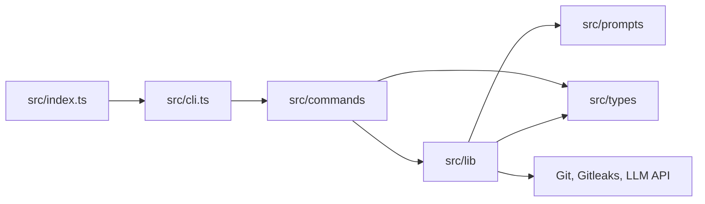

# zapdev

## Project Introduction

**zapdev** is a lightweight TypeScript CLI that makes small, repetitive Git chores fast and precise.

It stages changes, scans them for secrets, and generates Conventional Commit messages for one repository or several direct child repositories in a single review flow.

## Project Architecture



- `src/index.ts`: bin launcher; enables the V8 compile cache, then loads `cli.js`.
- `src/cli.ts`: CLI entry; registers `commit` as the default command.
- `src/commands/`: command UI and orchestration.
- `src/lib/`: pure logic and isolated Git, Gitleaks, and LLM side effects.
- `src/prompts/`: LLM prompts inlined into the bundle at build time.
- `src/types/`: shared type declarations.

## Environment Variables

| Variable | Required | Description |
| -------- | -------- | ----------- |
| `ZD_URL` | For `commit` | Complete HTTP(S) Chat Completions endpoint, including its path |
| `ZD_MODEL` | For `commit` | Model identifier supported by the endpoint |
| `ZD_EFFORT` | For `commit` | Sent as `reasoning_effort`; use a value supported by your model, such as `low`, `medium`, or `high` |

There are no defaults, automatic provider detection, or backup models. CLI flags override these variables. Legacy `OLLAMA_*` variables are no longer read.

Requests use the OpenAI Chat Completions format over plain `fetch`, without a provider SDK. No authentication headers are sent; use an endpoint that does not require them. The endpoint and model must support `reasoning_effort`.

## Setup

### Requirements

- **Node.js >= 20 (required):** runs the CLI.
- **Git (required):** provides the repository operations.
- **OpenAI-compatible Chat Completions endpoint (required for `commit`):** generates Conventional Commit messages.
- **Gitleaks (recommended):** scans staged changes before message generation when available on `PATH`.

### Install

Install zapdev globally for daily use:

```bash
npm install -g zapdev
```

Configure your endpoint and model before running `commit` (replace these example values):

```bash
export ZD_URL="http://localhost:1234/v1/chat/completions"
export ZD_MODEL="your-model-id"
export ZD_EFFORT="low"
```

Or run it once without installing:

```bash
npx zapdev commit
```

### Development Setup

From a clone:

```bash
npm install
npm run zapdev      # build then run the CLI in dev
npm run typecheck   # tsc --noEmit
npm run lint        # eslint
npm run test        # vitest
npm run build       # bundle to dist/ with esbuild
```

`npm link` exposes the local `zapdev` binary after `npm run build`.

## Usage

Run `zapdev` or `zapdev commit` to start the commit flow. Both accept the flags below.

### `zapdev commit`

Stages all changes, scans them with Gitleaks when installed, generates Conventional Commit messages, and optionally pushes the commits.

- **Inside a Git repository:** uses that repository only, including when launched from a subdirectory. Does not inspect child repositories.
- **Outside a Git repository:** processes only direct child repositories. No recursive search; `node_modules` is excluded.
- **Unified review:** generates messages in parallel, then presents every message with its repository name.
- **Actions:** commit all, commit only a named repository, edit a named repository's message, or cancel. Editing returns to the review menu.

Repositories with nothing to commit are skipped. Unselected or cancelled changes remain staged. Push confirmation is asked once for the successfully committed repositories.

```bash
zapdev commit
```

| Flag                | Description                                                       |
| ------------------- | ----------------------------------------------------------------- |
| `--url <url>`       | Override the complete Chat Completions endpoint                   |
| `--model <model>`   | Override the model                                               |
| `--effort <effort>` | Override the reasoning effort                                    |
| `-t, --type <type>` | Force the Conventional Commit type (`feat`, `fix`, `chore`, etc.) |
| `-p, --push`        | Push after committing without asking                              |
| `-s, --staged`      | Commit only changes that are already staged                       |
| `-r, --rebase`      | Rebase on upstream if the push is rejected                        |
| `-m, --merge`       | Merge upstream if the push is rejected                            |
| `-y, --yes`         | Skip prompts and commit all prepared repositories                 |

```bash
zapdev commit -t feat      # force the type
zapdev commit --staged     # leave unstaged changes untouched
```

Before contacting the LLM endpoint, zapdev runs `gitleaks git --staged` in each changed repository when Gitleaks is installed. A failed scan skips that repository without sending its diff; when Gitleaks is absent, the scan is skipped. The staged diff is sent to the configured endpoint, which may be remote.

Failures are reported per repository while the others continue. Any failure produces a nonzero exit code.

Pushing is optimistic, with no preliminary fetch. If the branch is behind upstream, `--rebase` runs `git pull --rebase`, while `--merge` runs `git pull --no-rebase --no-edit`; zapdev then retries once. Without either flag, interactive runs ask whether to rebase, merge, or quit. Runs using `--yes` or without a TTY must provide one of the flags.

Without a TTY, zapdev commits all prepared repositories automatically and only pushes when `--push` is set.

### Zed IDE

For a faster review and commit workflow, review and stage changes from Zed's Git panel, then run `zapdev commit -syp` from a task. The command commits only staged changes, skips prompts, and pushes the commit.

Add the following tasks to `.zed/tasks.json`:

```json
[
  {
    "label": "Safely commit staged changes.",
    "command": "zapdev commit -s",
    "reveal": "always",
    "hide": "on_success",
    "reveal_target": "center"
  }
]
```

Add this entry to Zed's `keymap.json` to run the commit task with `ctrl-cmd-enter`:

```json
{
  "context": "Pane",
  "bindings": {
    "ctrl-cmd-enter": [
      "task::Spawn",
      { "task_name": "Safely commit staged changes." }
    ]
  }
}
```

### Shell Aliases

```bash
alias commit="zapdev commit --yes"
```

## Other

zapdev is available under the MIT license.
