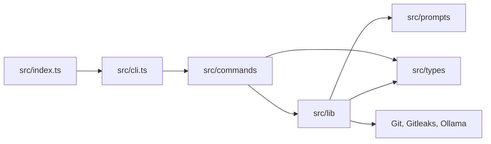

# zapdev

## Project Introduction

**zapdev** is a lightweight TypeScript CLI that makes small, repetitive Git chores fast and precise.

It stages changes, scans them for secrets, generates Conventional Commit messages with Ollama, and streamlines repository cleanup.

## Project Architecture



- `src/index.ts`: bin launcher; enables the V8 compile cache, then loads `cli.js`.
- `src/cli.ts`: CLI entry; registers subcommands and opens the interactive menu.
- `src/commands/`: command UI and orchestration.
- `src/lib/`: pure logic and isolated Git, Gitleaks, and Ollama side effects.
- `src/prompts/`: LLM prompts inlined into the bundle at build time.
- `src/types/`: shared type declarations.

## Environment Variables

| Variable | Default | Required | Description |
| --- | --- | --- | --- |
| `OLLAMA_URL` | `http://localhost:11434` | No | Ollama base URL |
| `OLLAMA_MODEL` | `deepseek-v4-flash:cloud` | No | Model used to generate commit messages |
| `OLLAMA_BACKUP_MODEL` | - | No | Model used when generation with the primary model fails |
| `OLLAMA_EFFORT` | `low` | No | Ollama thinking effort (`low`, `medium`, `high`, or `max`) |

## Setup

### Requirements

- **Node.js >= 20 (required):** runs the CLI.
- **Git (required):** provides the repository operations.
- **Ollama (required for `commit`):** generates Conventional Commit messages.
- **Gitleaks (recommended):** scans staged changes before message generation when available on `PATH`.

### Install

Install zapdev globally for daily use:

```bash
npm install -g zapdev
```

Or run it once without installing:

```bash
npx zapdev commit
```

### Development Setup

From a clone:

```bash
npm install
npm run zapdev      # build then run the CLI in dev
npm run typecheck   # tsc --noEmit
npm run lint        # eslint
npm run test        # vitest
npm run build       # bundle to dist/ with esbuild
```

`npm link` exposes the local `zapdev` binary after `npm run build`.

## Usage

Run `zapdev` with no command to pick one from an interactive menu. Without a TTY, zapdev displays its usage instead.

### `zapdev commit`

Stages all changes, scans them with Gitleaks when installed, generates a Conventional Commit message, and optionally pushes the commit.

```bash
zapdev commit
```

| Flag | Description |
| --- | --- |
| `--model <model>` | Override the Ollama model |
| `-t, --type <type>` | Force the Conventional Commit type (`feat`, `fix`, `chore`, etc.) |
| `-p, --push` | Push after committing without asking |
| `-s, --staged` | Commit only changes that are already staged |
| `-r, --rebase` | Rebase on upstream if the push is rejected |
| `-m, --merge` | Merge upstream if the push is rejected |
| `-y, --yes` | Skip prompts and commit directly |

```bash
zapdev commit -t feat      # force the type
zapdev commit --staged     # leave unstaged changes untouched
```

Before contacting Ollama, zapdev runs `gitleaks git --staged` when Gitleaks is installed. A failed scan stops the commit; when Gitleaks is absent, the scan is skipped.

Pushing is optimistic, with no preliminary fetch. If the branch is behind upstream, `--rebase` runs `git pull --rebase`, while `--merge` runs `git pull --no-rebase --no-edit`; zapdev then retries once. Without either flag, interactive runs ask whether to rebase, merge, or quit. Runs using `--yes` or without a TTY must provide one of the flags.

Without a TTY, zapdev commits automatically and only pushes when `--push` is set.

### `zapdev reset`

Operates on a Git repository or the direct child repositories of a directory. It fetches and prunes, switches branch, then permanently removes other local branches and linked worktrees.

```bash
zapdev reset                 # reset the current repo or direct child repos
zapdev reset ~/dev           # reset repos under a directory
zapdev reset -p              # switch to the principal branch without prompting
zapdev reset -t dev          # switch to dev or fall back to the principal branch
```

| Flag | Description |
| --- | --- |
| `-p, --principal` | Switch every repo to its resolved principal branch (`origin/HEAD`) |
| `-t, --target <branch>` | Switch to a target branch, falling back to the principal branch |
| `--pull` | Pull the checked-out branch after reset without asking |
| `-y, --yes` | Switch and delete without confirmation |

Deletion is permanent. Branches are removed with `git branch -D`; worktrees are removed with `git worktree remove --force`. Without a TTY, pass `--yes` or the destructive step is refused. `node_modules` is never scanned.

### Shell Aliases

```bash
alias commit="zapdev commit --yes"
alias git-reset="zapdev reset --yes --principal --pull"
```

## Other

zapdev is available under the MIT license.
