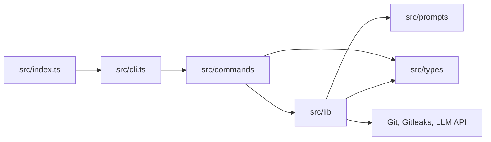

<p align="center">
  
</p>

---

[](https://mvagnon.dev)
[](https://buymeacoffee.com/mvagnon)

# zapdev

## Project Introduction

**zapdev** is a lightweight TypeScript CLI that makes small, repetitive Git chores fast and precise.

It stages changes, scans them for secrets, and generates Conventional Commit messages for one repository or several direct child repositories in a single review flow.

## Project Architecture


```mermaid
flowchart LR
  Entry["src/index.ts"] --> CLI["src/cli.ts"]
  CLI --> Commands["src/commands"]
  Commands --> Lib["src/lib"]
  Commands --> Types["src/types"]
  Lib --> Prompts["src/prompts"]
  Lib --> Types
  Lib --> Tools["Git, Gitleaks, LLM API"]
```

- `src/index.ts`: bin launcher; enables the V8 compile cache, then loads `cli.js`.
- `src/cli.ts`: CLI entry; registers `commit` as the default command.
- `src/commands/`: command UI and orchestration.
- `src/lib/`: pure logic and isolated Git, Gitleaks, and LLM side effects.
- `src/prompts/`: LLM prompts inlined into the bundle at build time.
- `src/types/`: shared type declarations.

## Environment Variables

| Variable          | Required     | Description                                                                                         |
| ----------------- | ------------ | --------------------------------------------------------------------------------------------------- |
| `ZD_URL`          | For `commit` | Complete HTTP(S) Chat Completions endpoint, including its path                                      |
| `ZD_MODEL`        | For `commit` | Model identifier supported by the endpoint                                                          |
| `ZD_EFFORT`       | For `commit` | Sent as `reasoning_effort`; use a value supported by your model, such as `low`, `medium`, or `high` |
| `ZD_HOOK_TIMEOUT` | No           | Deadline per Git hook in seconds (default: `60`); positive numbers from `0.001` to `2147483.647`    |

The LLM settings have no defaults, automatic provider detection, or backup models. CLI flags override these settings. Legacy `OLLAMA_*` variables are no longer read.

Requests use the OpenAI Chat Completions format over plain `fetch`, without a provider SDK. No authentication headers are sent; use an endpoint that does not require them. The endpoint and model must support `reasoning_effort`.

## Setup

### Requirements

- **Node.js >= 20 (required):** runs the CLI.
- **Git (required):** provides the repository operations.
- **OpenAI-compatible Chat Completions endpoint (required for `commit`):** generates Conventional Commit messages.
- **Gitleaks (recommended):** scans staged changes before message generation when available on `PATH`.

### Install

Install zapdev globally for daily use:

```bash
npm install -g zapdev
```

or

```bash
bun install -g zapdev
```

Configure your endpoint and model before running `commit` (replace these example values):

```bash
export ZD_URL="http://localhost:1234/v1/chat/completions"
export ZD_MODEL="your-model-id"
export ZD_EFFORT="low"
```

Or run it once without installing:

```bash
npx zapdev commit
```

### Development Setup

From a clone:

```bash
npm install
npm run zapdev      # build then run the CLI in dev
npm run typecheck   # tsc --noEmit
npm run lint        # eslint
npm run test        # vitest
npm run build       # bundle to dist/ with esbuild
```

`npm link` exposes the local `zapdev` binary after `npm run build`.

## Usage

Run `zapdev` or `zapdev commit` to start the commit flow. Both accept the flags below.

### `zapdev commit`

Stages changes, scans for secrets with Gitleaks when installed, generates Conventional Commit messages, then lets you review and optionally push.

- **Repositories:** uses the current Git repository (including from a subdirectory), or direct child repositories when outside one. No recursive search; `node_modules` is excluded.
- **Review:** commit all, commit one repository, edit a message, or cancel. Unselected changes remain staged.
- **Push:** asks once, only for repositories committed during this run. Use `--push` to skip confirmation or `--no-push` to keep commits local.

| Flag                        | Description                                           |
| --------------------------- | ----------------------------------------------------- |
| `--url <url>`               | Override the Chat Completions endpoint                |
| `--model <model>`           | Override the model                                    |
| `--effort <effort>`         | Override the reasoning effort                         |
| `-t, --type <type>`         | Force a commit type; append `!` for a breaking change |
| `-p, --push`                | Push without confirmation                             |
| `--no-push`, `--push=false` | Keep commits local without confirmation               |
| `--pull`                    | Pull fast-forward updates before staging              |
| `-A, --ask-for-branch`      | Ask for a branch before every commit                  |
| `-s, --staged`              | Commit only already-staged changes                    |
| `-y, --yes`                 | Skip review, not branch or push prompts               |

```bash
zapdev commit              # review messages, commit, then confirm push
zapdev commit -t feat      # force the commit type
zapdev commit -t 'feat!'   # force a breaking change
zapdev commit -syp         # commit staged changes and push without review
zapdev commit --pull       # pull first, then follow the normal flow
```

Supported types: `feat`, `fix`, `deps`, `chore`, `docs`, `style`, `refactor`, `perf`, `test`, `build`, `ci`, `revert`. Messages are limited to 72 characters; the model can add `!` for breaking changes.

**Branches:** before committing on `main`, `master`, `principal`, `dev`, or `development`, zapdev asks for a local branch—even with `--yes`. A different name switches to an existing branch or creates it **before the commit**. Prompts reuse the previous input; empty input keeps the current branch. `-A` asks on every branch.

**Safety:** a failed Gitleaks scan stops the flow before any commit or sending that repository's diff to the LLM. Without Gitleaks, scanning is skipped. Commit context is sent to your configured endpoint, which may be remote; binary content and patches matching `src/config/diff.gitignore` are omitted, but those files are still committed.

**Git:** `--pull` only pulls repositories with changes to commit and a configured upstream, without rebase or automatic stash. Push uses the current branch's name and its upstream remote, then `origin`, then the only remote; ambiguous or missing remotes are skipped. No force-push. Errors stop the flow without undoing earlier pulls or commits; cancelling branch selection also stops all pushes.

**Without a terminal:** review is skipped, commits requiring a branch prompt are refused, and commits stay local unless `--push` is set. Git hooks have a 60-second timeout (`ZD_HOOK_TIMEOUT` to override); interactive hooks must use `/dev/tty`.

### Zed IDE

For a faster review and commit workflow, review and stage changes from Zed's Git panel, then run `zapdev commit -syp` from a task. The command commits only staged changes, skips commit review and push confirmation, and asks for a branch before committing only if the current branch is protected.

Add the following tasks to `.zed/tasks.json`:

```json
[
  {
    "label": "zapdev commit",
    "command": "zapdev commit --yes",
    "reveal": "always",
    "hide": "on_success",
    "reveal_target": "center"
  }
]
```

Add this entry to Zed's `keymap.json` to run the commit task with `ctrl-cmd-enter`:

```json
{
  "context": "Pane",
  "bindings": {
    "ctrl-cmd-enter": ["task::Spawn", { "task_name": "zapdev commit" }]
  }
}
```

### Shell Aliases

```bash
alias commit="zapdev commit --yes"
```

## Other

zapdev is available under the MIT license.
