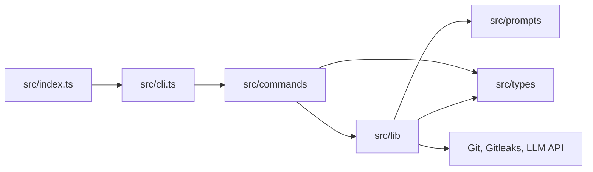

<p align="center">
  
</p>

---

[](https://mvagnon.dev)
[](https://buymeacoffee.com/mvagnon)

# zapdev

## Project Introduction

**zapdev** is a lightweight TypeScript CLI that makes small, repetitive Git chores fast and precise.

It stages changes, scans them for secrets, and generates Conventional Commit messages for one repository or several direct child repositories in a single review flow.

## Project Architecture


```mermaid
flowchart LR
  Entry["src/index.ts"] --> CLI["src/cli.ts"]
  CLI --> Commands["src/commands"]
  Commands --> Lib["src/lib"]
  Commands --> Types["src/types"]
  Lib --> Prompts["src/prompts"]
  Lib --> Types
  Lib --> Tools["Git, Gitleaks, LLM API"]
```

- `src/index.ts`: bin launcher; enables the V8 compile cache, then loads `cli.js`.
- `src/cli.ts`: CLI entry; registers `commit` as the default command.
- `src/commands/`: command UI and orchestration.
- `src/lib/`: pure logic and isolated Git, Gitleaks, and LLM side effects.
- `src/prompts/`: LLM prompts inlined into the bundle at build time.
- `src/types/`: shared type declarations.

## Environment Variables

| Variable          | Required     | Description                                                                                         |
| ----------------- | ------------ | --------------------------------------------------------------------------------------------------- |
| `ZD_URL`          | For `commit` | Complete HTTP(S) Chat Completions endpoint, including its path                                      |
| `ZD_MODEL`        | For `commit` | Model identifier supported by the endpoint                                                          |
| `ZD_EFFORT`       | For `commit` | Sent as `reasoning_effort`; use a value supported by your model, such as `low`, `medium`, or `high` |
| `ZD_HOOK_TIMEOUT` | No           | Deadline per Git hook in seconds (default: `60`); positive numbers from `0.001` to `2147483.647` |

The LLM settings have no defaults, automatic provider detection, or backup models. CLI flags override these settings. Legacy `OLLAMA_*` variables are no longer read.

Requests use the OpenAI Chat Completions format over plain `fetch`, without a provider SDK. No authentication headers are sent; use an endpoint that does not require them. The endpoint and model must support `reasoning_effort`.

## Setup

### Requirements

- **Node.js >= 20 (required):** runs the CLI.
- **Git (required):** provides the repository operations.
- **OpenAI-compatible Chat Completions endpoint (required for `commit`):** generates Conventional Commit messages.
- **Gitleaks (recommended):** scans staged changes before message generation when available on `PATH`.

### Install

Install zapdev globally for daily use:

```bash
npm install -g zapdev
```

or

```bash
bun install -g zapdev
```

Configure your endpoint and model before running `commit` (replace these example values):

```bash
export ZD_URL="http://localhost:1234/v1/chat/completions"
export ZD_MODEL="your-model-id"
export ZD_EFFORT="low"
```

Or run it once without installing:

```bash
npx zapdev commit
```

### Development Setup

From a clone:

```bash
npm install
npm run zapdev      # build then run the CLI in dev
npm run typecheck   # tsc --noEmit
npm run lint        # eslint
npm run test        # vitest
npm run build       # bundle to dist/ with esbuild
```

`npm link` exposes the local `zapdev` binary after `npm run build`.

## Usage

Run `zapdev` or `zapdev commit` to start the commit flow. Both accept the flags below.

### `zapdev commit`

Stages all changes, scans them with Gitleaks when installed, generates Conventional Commit messages, and optionally pushes the commits.

- **Inside a Git repository:** uses that repository only, including when launched from a subdirectory. Does not inspect child repositories.
- **Outside a Git repository:** processes only direct child repositories. No recursive search; `node_modules` is excluded.
- **Unified review:** generates messages in parallel, then presents every message with its repository name and branch. Repositories with pending changes are shown in bold and underlined when terminal styling is enabled.
- **Actions:** commit all, commit only a named repository, edit a named repository's message, or cancel. Editing returns to the review menu.

Repositories with no new changes can still send existing commits. Unselected or cancelled changes remain staged; failed or unselected commit drafts are not pushed. The branch is chosen before committing, never when pushing. Push confirmation is asked once.

```bash
zapdev commit
```

| Flag                | Description                                                       |
| ------------------- | ----------------------------------------------------------------- |
| `--url <url>`       | Override the complete Chat Completions endpoint                   |
| `--model <model>`   | Override the model                                                |
| `--effort <effort>` | Override the reasoning effort                                     |
| `-t, --type <type>` | Force an exact lowercase Conventional Commit type (`feat`, `fix`, `chore`, etc.) |
| `-p, --push`        | Skip push confirmation and push the current branch                |
| `-s, --staged`      | Commit only changes that are already staged                       |
| `-y, --yes`         | Skip commit review; still confirm push unless `--push` is set     |

```bash
zapdev commit -t feat      # force the type
zapdev commit --staged     # leave unstaged changes untouched
zapdev commit -y           # commit automatically, then ask before pushing
zapdev commit -yp          # skip review and push confirmation; choose a branch if protected
```

Before contacting the LLM endpoint, zapdev runs `gitleaks git --staged --verbose` in each changed repository when Gitleaks is installed. A failed scan skips that repository without sending its diff; when Gitleaks is absent, the scan is skipped. The staged diff is sent to the configured endpoint, which may be remote.

Preparation and commit failures are reported per repository while the others continue. A push failure stops all remaining sends. Any failure produces a nonzero exit code.

In a terminal, Git and its hooks display live logs and support native prompts, even with `--yes` (which skips commit review, not native Git prompts). Git controls hook stdin; interactive hooks should read from the terminal, for example `/dev/tty`. Each hook has a 60-second deadline, including time spent answering prompts; override it with `ZD_HOOK_TIMEOUT=120 zapdev commit`.

Immediately before each selected commit, zapdev asks for a local branch only when the current name exactly matches `main`, `master`, `principal`, `dev`, or `development`, including with `--yes`. The first prompt starts empty; subsequent prompts reuse the previous input across repositories. Press Enter to accept the prefilled name; an empty or cleared input keeps the current branch and leaves the next prompt empty. A different name switches to the existing local branch or creates it from HEAD, without forcing or discarding pending changes. Other branches and repositories with nothing to commit never trigger this prompt. Cancelling stops the remaining commits and all pushes; earlier commits remain local.

Pushes always target a remote branch with the current local branch's name, with no destination input. Classic pushes use the current branch's upstream remote, or the only configured remote if there is no upstream, and run `git push <remote> HEAD:refs/heads/<current-branch>`. Ambiguous remotes are skipped with a warning. Both modes check for unpublished commits against that remote branch, falling back to the remote's default branch (`HEAD`) if it is missing. If neither reference exists, publication is attempted. Classic mode compares HEAD; subtree mode compares its extracted history. Already published history is skipped. No rebase, merge, retry, or force-push.

Without a TTY, zapdev commits prepared repositories on nonprotected branches automatically; protected-branch commits are refused and changes remain staged. `--push` can publish without a TTY; without it, commits stay local. Repositories without new changes do not trigger an LLM call, branch prompt, or new commit.

#### Subtree publication

Place an optional `zapdev.json` in the directory where you launch zapdev:

```json
{
  "subtrees": {
    "projet-front": "front",
    "projet-back": "back"
  }
}
```

| `zapdev.json` option | Default | Effect |
| ------------------- | ------- | ------ |
| `subtrees` | `{}` | Map repository-relative folders to Git remote names. A nonempty mapping replaces classic push with subtree publication. |

- **Scope:** only the launch directory's file is read, not parents or child repositories. Its mapping applies to newly committed repositories and repositories without new changes.
- **Configuration:** only `zapdev.json` selects subtree mode; no subtree CLI flag. Missing or empty `subtrees` uses classic push. Invalid configuration stops the command before staging. Replace the removed `isSubtree` option with an explicit mapping.
- **Destinations:** only mapped folders are published, using their configured remotes; folder and remote names need not match. All subtrees use the parent repository's current branch name. The parent itself is not pushed. Detached HEAD is refused.
- **Publication:** check each subtree using the shared unpublished-commit rule above, then run `git subtree push --prefix=<folder> <remote> <current-branch>`. Subtrees without unpublished commits are skipped without creating remote branches; uncommitted changes are excluded.
- **Failures:** stop all remaining publications, leaving earlier publications intact. No automatic recovery.

Interactive runs still ask for publication confirmation, including with `--yes`; `--push` skips that confirmation. The commit and branch-selection flow is identical to classic mode.

```bash
zapdev commit       # with subtrees configured, ask to publish after committing
zapdev commit -yp   # publish changed subtrees on the parent's current branch
```

### `zapdev subtree-init`

Create or extend a repository with squashed subtrees, named remotes, and the matching `zapdev.json`. No gum or LLM configuration required.

```bash
zapdev subtree-init my-project \
  front=git@github.com:org/front.git \
  back=git@github.com:org/back.git \
  --origin git@github.com:org/project.git
```

| Parameter | Effect |
| --------- | ------ |
| `<directory>` | Repository to create or extend. New repositories start on `main`; existing branches are kept. |
| `<name=url>...` | One or more sources. Each name is both the subtree folder and its Git remote name. |
| `--origin <url>` | Optional parent repository remote; replaces the shell helper's `remote=url` argument. |

- Requires a clean working tree, including untracked files. Existing folders, conflicting mappings or remote URLs, and a symlinked `zapdev.json` are refused before importing any subtree.
- Detects each source's default branch, falling back to `main` with a warning when unavailable; imports with `git subtree add --squash`.
- Commits the explicit folder-to-remote mapping before imports, preserving existing mappings and other JSON settings. Example: `{"subtrees":{"front":"front","back":"back"}}`.
- Does not push. Git failures stop immediately without rollback; configuration, remotes, and earlier imports remain in place.

### Zed IDE

For a faster review and commit workflow, review and stage changes from Zed's Git panel, then run `zapdev commit -syp` from a task. The command commits only staged changes, skips commit review and push confirmation, and asks for a branch before committing only if the current branch is protected.

Add the following tasks to `.zed/tasks.json`:

```json
[
  {
    "label": "Safely commit staged changes.",
    "command": "zapdev commit -s",
    "reveal": "always",
    "hide": "on_success",
    "reveal_target": "center"
  }
]
```

Add this entry to Zed's `keymap.json` to run the commit task with `ctrl-cmd-enter`:

```json
{
  "context": "Pane",
  "bindings": {
    "ctrl-cmd-enter": [
      "task::Spawn",
      { "task_name": "Safely commit staged changes." }
    ]
  }
}
```

### Shell Aliases

```bash
alias commit="zapdev commit --yes"
```

## Other

zapdev is available under the MIT license.
