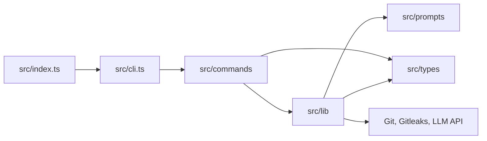

<p align="center">
  
</p>

---

[](https://mvagnon.dev)
[](https://buymeacoffee.com/mvagnon)

# zapdev

> [!TIP]
> **Working with an AI assistant?** Use **[zapdev-mcp](https://github.com/mvagnon/zapdev-mcp)**
> to expose preparation, services, commit, and pull request tools directly to your MCP client.

## Project Introduction

**zapdev** is a lightweight TypeScript CLI that makes small, repetitive Git chores fast and precise.

It stages changes, scans them for secrets, and generates Conventional Commit messages for one repository or several direct child repositories in a single review flow.
It also prepares disposable checkouts and worktrees, links secrets, and manages configured development services.

## Project Architecture


```mermaid
flowchart LR
  Entry["src/index.ts"] --> CLI["src/cli.ts"]
  CLI --> Commands["src/commands"]
  Commands --> Lib["src/lib"]
  Commands --> Types["src/types"]
  Lib --> Prompts["src/prompts"]
  Lib --> Types
  Lib --> Tools["Git, Gitleaks, LLM API"]
```

- `src/index.ts`: bin launcher; enables the V8 compile cache, then loads `cli.js`.
- `src/cli.ts`: CLI entry; opens the command menu and routes explicit commands or the legacy commit shorthand.
- `src/commands/`: command UI and orchestration.
- `src/lib/`: pure logic and isolated Git, Gitleaks, and LLM side effects.
- `src/prompts/`: LLM prompts inlined into the bundle at build time.
- `src/types/`: shared type declarations.

## Environment Variables

| Variable          | Required     | Description                                                                                         |
| ----------------- | ------------ | --------------------------------------------------------------------------------------------------- |
| `ZD_URL`          | For `commit` / `pr` | Complete HTTP(S) Chat Completions endpoint, including its path                                      |
| `ZD_MODEL`        | For `commit` / `pr` | Model identifier supported by the endpoint                                                          |
| `ZD_EFFORT`       | For `commit` / `pr` | Sent as `reasoning_effort`; use a value supported by your model, such as `low`, `medium`, or `high` |
| `ZD_API_KEY`      | No           | API key sent as `Authorization: Bearer <key>`; omit for endpoints without authentication            |
| `ZD_HOOK_TIMEOUT` | No           | Deadline per Git hook in seconds (default: `60`); positive numbers from `0.001` to `2147483.647`    |
| `ZD_REPOS_DIR` | No | Absolute disposable checkout root and configuration/secrets scope; defaults to `~/.zapdev/repos` |

The LLM settings have no defaults, automatic provider detection, or backup models. CLI flags override these settings. Legacy `OLLAMA_*` variables are no longer read.

Requests use the OpenAI Chat Completions format over plain `fetch`, without a provider SDK. Set `ZD_API_KEY` if your endpoint requires Bearer authentication; when absent or blank, no authentication header is sent. The endpoint and model must support `reasoning_effort` and **strict Structured Outputs** (`response_format.type: "json_schema"`, `strict: true`), including string `pattern` constraints with character ranges and bounded repetitions. OpenAI compatibility or JSON mode alone is not sufficient. There is no plain-text fallback.

## Setup

### Requirements

- **Node.js >= 20 (required):** runs the CLI.
- **Git (required):** provides the repository operations.
- **OpenAI-compatible Chat Completions endpoint and model with strict JSON Schema Structured Outputs support (required for `commit` and `pr`):** generates commit messages and PR titles.
- **GitHub CLI (`gh`, required for `pr`):** install it and authenticate with `gh auth login`.
- **Gitleaks (recommended):** scans staged changes before message generation when available on `PATH`.
- **Linux/systemd user manager:** required for `services start` and `services stop`.
- **Readable journals and journalctl 257+:** required for `services logs`.

### Install

Install zapdev globally for daily use:

```bash
npm install -g zapdev
```

or

```bash
bun install -g zapdev
```

Or run it once without installing:

```bash
npx zapdev commit
```

### Model Configuration

Choose one configuration before running `zapdev commit`. Use the complete Chat Completions URL, not just the API base URL.

#### Local model

Start an OpenAI-compatible local server and load a model (for example, in LM Studio). Check that the server/model combination enforces strict JSON Schema structured outputs, then use its model identifier and supported reasoning effort:

```bash
export ZD_URL="http://localhost:1234/v1/chat/completions"
export ZD_MODEL="your-local-model-id"
export ZD_EFFORT="low"
unset ZD_API_KEY
zapdev commit
```

No API key is needed for a server without authentication. If your local server requires one, set `ZD_API_KEY` instead.

#### OpenRouter

Create an API key at [OpenRouter](https://openrouter.ai/settings/keys) and choose a [model/provider supporting structured outputs](https://openrouter.ai/models?supported_parameters=structured_outputs):

```bash
export ZD_URL="https://openrouter.ai/api/v1/chat/completions"
export ZD_MODEL="your-structured-output-model-id"
export ZD_EFFORT="low"
export ZD_API_KEY="your-openrouter-api-key"
zapdev commit
```

Model availability, quotas, supported reasoning efforts, and JSON Schema enforcement depend on the model and provider. zapdev sends `provider.require_parameters: true` to OpenRouter so requests are routed only to providers supporting the requested parameters. Keep your API key private.

Requests to `openrouter.ai` automatically include `HTTP-Referer: https://mvagnon.dev/zapdev-cli` and `X-OpenRouter-Title: zapdev CLI` for app attribution. These headers are not sent to local servers or other endpoints.

Provider errors display the HTTP status and available error code, provider name, error type, and raw details; JSON details are formatted for readability. Errors returned inside HTTP 200 responses also stop the commit flow. Check [OpenRouter Activity](https://openrouter.ai/activity) for additional diagnostics.

### Development Setup

From a clone:

```bash
npm install
```

| Command                | Description                                    |
| ---------------------- | ---------------------------------------------- |
| `npm run zapdev`       | Build and run the CLI                          |
| `npm run typecheck`    | Check TypeScript types                         |
| `npm run lint`         | Run ESLint                                     |
| `npm run knip`         | Check unused files, exports, and dependencies  |
| `npm run test`         | Run Vitest                                     |
| `npm run staticchecks` | Run lint, typecheck, Knip, and tests, as in CI |
| `npm run build`        | Bundle to `dist/` with esbuild                 |

`npm link` exposes the local `zapdev` binary after `npm run build`.

## Usage

Run `zapdev` without arguments to choose a command from an interactive menu.
Choose `services` to select `list`, `start`, `stop`, or `logs` in a second menu.
Cancelling either menu runs nothing.
Without a terminal, bare `zapdev` shows help instead of executing a command.

Run `zapdev commit` to start the commit flow directly.
Existing flag-only invocations, such as `zapdev --non-interactive --json`, still run `commit` for compatibility.

### `zapdev commit`

Stages changes, scans for secrets with Gitleaks when installed, generates Conventional Commit messages, then lets you review and optionally push.

- **Repositories:** accepts an optional path, defaulting to the current directory.
  Uses its enclosing Git repository (including from a subdirectory), or direct child repositories when outside one.
  No recursive search; `node_modules` is excluded.
  Does not change your terminal's directory.
- **Review:** commit all, commit one repository, edit a message, or cancel. Unselected changes remain staged.
- **Push:** asks once, only for repositories committed during this run. Use `--push` to skip confirmation or `--no-push` to keep commits local. With `--non-interactive`, nothing is pushed unless `--push` is explicitly set.

| Flag                        | Description                                                                     |
| --------------------------- | ------------------------------------------------------------------------------- |
| `--url <url>`               | Override the Chat Completions endpoint                                          |
| `--model <model>`           | Override the model                                                              |
| `--effort <effort>`         | Override the reasoning effort                                                   |
| `-t, --type <type>`         | Force a commit type; append `!` for a breaking change                           |
| `-T, --ask-for-type`        | Choose a type for all commits, then confirm breaking (default: no)              |
| `-p, --push`                | Push without confirmation                                                       |
| `--no-push`, `--push=false` | Keep commits local without confirmation                                         |
| `--pull`                    | Pull fast-forward updates before staging                                        |
| `--branch <name>`           | Use this branch in every repository without asking; create it if needed         |
| `-A, --ask-for-branch`      | Ask for a branch before every commit                                            |
| `-s, --staged`              | Commit only already-staged changes                                              |
| `--non-interactive`        | Skip every question, retain defaults and keep commits local unless `--push` is set |
| `--json` | Emit structured commit results and warnings; requires `--non-interactive` in a terminal |

```bash
zapdev commit              # review messages, commit, then confirm push
zapdev commit ../my-repo --non-interactive # commit another repository without changing directory
zapdev commit -t feat      # force the commit type
zapdev commit -t 'feat!'   # force a breaking change
zapdev commit -sp --non-interactive # commit staged changes and push without review
zapdev commit --pull       # pull first, then follow the normal flow
zapdev commit --branch="feature/shared" --non-interactive # commit all repositories on this branch without prompts
zapdev commit --non-interactive --json # structured output for agents and scripts
```

Supported types: `feat`, `fix`, `deps`, `chore`, `docs`, `style`, `refactor`, `perf`, `test`, `build`, `ci`, `revert`. Messages should aim for 72 characters. The generation schema limits descriptions to 160 characters and scopes to 32 to prevent runaway output; manually edited messages can be longer. Generation has a 25-second timeout and no retries.

**Message generation:** in automatic mode, the model returns `type`, `scope` (or `null`), `breaking`, and `description` as structured fields; zapdev assembles `type(scope)!: description` locally. With `--type` or a manually selected type, the model returns only `scope` (or `null`) and `description`; zapdev uses the exact selected type and any explicit `!` to assemble the header. Scope is optional in both modes: `null` omits it. Selecting `auto` keeps automatic generation. There are no commit-format correction retries; refusals, incomplete responses, and endpoints that do not honor the schema stop the flow before committing.

`--non-interactive` never asks questions, including with `-T` or `-A`.
Explicit values and actions still apply: `--type`, `--branch`, `--push`, `--no-push`, `--pull`, `--staged`, and LLM overrides.
Without explicit values, the type remains automatic and the current branch is retained.

Deprecated `--yes` / `-y` remain available for existing scripts.
They preserve their previous behavior: skip default prompts, but still honor explicit `-T` / `-A` questions.

**Branches:** `--branch <name>` uses the given local branch in every selected repository without a branch prompt, even with `-A`. It switches to the existing branch or creates it from HEAD **before the commit**, preserving pending changes without force. Otherwise, before committing on `main`, `master`, `principal`, `dev`, or `development`, zapdev asks for a local branch unless non-interactive mode is set. A different name switches to an existing branch or creates it **before the commit**. Prompts reuse the previous input; empty input keeps the current branch. `-A` asks on every branch unless `--branch` or `--non-interactive` is supplied.

**Safety:** a failed Gitleaks scan stops the flow before any commit or sending that repository's diff to the LLM. Without Gitleaks, scanning is skipped. Commit context is sent to your configured endpoint, which may be remote; binary content and patches matching `src/config/diff.gitignore` are omitted, but those files are still committed.

**Git:** `--pull` only pulls repositories with changes to commit and a configured upstream, without rebase or automatic stash. Push uses the current branch's name and its upstream remote, then `origin`, then the only remote; ambiguous or missing remotes are skipped. No force-push. Errors stop the flow without undoing earlier pulls or commits; cancelling branch selection also stops all pushes.

**Without a terminal:** use `--non-interactive` to accept defaults without any questions, including on protected branches.
Without that flag, explicit `-T` / `-A` prompts still require a terminal; `--branch` bypasses `-A`.
Commits stay local unless `--push` is set.
Git hooks have a 60-second timeout (`ZD_HOOK_TIMEOUT` to override); interactive hooks must use `/dev/tty`.

**JSON output:** `zapdev commit --non-interactive --json` (or `zapdev --non-interactive --json`) writes one object to stdout.
It contains `commits` entries with `repo`, `branch`, `message`, and `pushed`, plus a `warnings` array.
`pushed: true` confirms that the push succeeded; `false` means no push was confirmed, not a guarantee about remote state after a failure.
Unchanged repositories produce no commit entry.
Prompts, progress and human-readable messages are suppressed; native Git and scan diagnostics go to stderr.
Runtime failures add an `error` string and set exit code 1, preserving completed commits and confirmed pushes.
Inspect local and remote state before retrying an error.

### `zapdev pr`

Creates a GitHub pull request for the selected repository and branch.
Accepts an optional path, defaulting to the current directory.
Outside a Git repository, detects direct child repositories, like `commit`.

```bash
zapdev pr
zapdev pr -b develop
zapdev pr --non-interactive -b develop
zapdev pr --closes https://github.com/owner/repo/issues/123
zapdev pr -c https://trello.com/c/abc/task
zapdev pr ../my-worktree --cleanup-worktrees
zapdev pr ../my-worktree --non-interactive --cleanup-worktrees --json
```

| Flag | Description |
| ---- | ----------- |
| `-c, --closes <url>` | Append `Closes <url>` for the PM task; optional HTTP(S) URL |
| `-b, --branch <name>` | Target branch; defaults to the GitHub repository's default branch |
| `--non-interactive` | Push branches and create all PRs without questions |
| `--cleanup-worktrees` | Remove the source branch's linked worktree directories after successful PR creation, without force |
| `--json` | Emit one JSON result on stdout, with PR URLs and deleted/skipped worktrees; requires `--non-interactive` in a terminal |
| `--url`, `--model`, `--effort` | Override the same LLM settings as `commit` |

- Requires a clean working tree, including staged, unstaged and untracked files. Otherwise, stops before fetching, generating a title or pushing, with instructions to commit or stash changes. This also applies with `--non-interactive` and without a terminal.
- Fetches the target branch (`--branch`, or the GitHub repository's default branch), then reads **all complete commit messages unique to the current branch** relative to that target, oldest first. Uses the upstream remote, then `origin`, then the only remote; ambiguous remotes are refused.
- Generates a Conventional Commit-style title with the configured LLM. Commit messages are sent in full, without truncation; the model's context limit still applies.
- Builds the description locally: bullet points grouped by commit type, bold scopes, and a separate breaking-changes section for `!`, `BREAKING CHANGE:`, or `BREAKING-CHANGE:`. Unlike a release changelog, all types are included; nonconventional subjects go under Other Changes.
- Shows the title and description, then asks before pushing and creating the PR. With `--non-interactive`, legacy `--yes` / `-y`, or without a terminal, proceeds without confirmation. Never force-pushes or stages pending changes.
- With multiple repositories, prepares PRs in parallel and lets you create all PRs or just one. Every repository must have a clean working tree and a valid PR context; preparation failures stop the command before any push or PR creation. `--branch` and `--closes` apply to every PR.
- Worktree cleanup is **opt-in** with `--cleanup-worktrees`:
  - Can remove the current worktree, even when run from a subdirectory or symlinked path; afterward, use `cd` to enter an existing directory.
  - After all selected PRs are created successfully, removes matching worktree directories and Git registrations, **including ignored files** inside those directories.
  - Preserves the main worktree, branches and commits.
  - Skips locked, missing, dirty (including untracked files), or branch/HEAD-changed worktrees with warnings; deletion is never forced.
  - Prints each successfully deleted directory, not just a generic cleanup message.
- With `--json`, stdout contains only a JSON object with a `pullRequests` array.
  Each entry contains `repo`, `branch`, `url`, `deletedWorktrees` (paths), and `skippedWorktrees` (`path` and `reason` objects).
  Cleanup arrays are empty when nothing was deleted or skipped, including when cleanup was not requested.
  Prompts and human-readable progress are suppressed; native Git diagnostics go to stderr.
  Runtime failures add an `error` string and set exit code 1, preserving any PR results already completed.
- Targets the selected remote's repository; does not create forks. `Closes` adds a reference, not a direct PM API action; automatic task closure depends on the provider's integration.

### Preparation and services

These commands ask for missing arguments and confirm mutations in a terminal.
Use `--non-interactive` to skip all questions and accept defaults, and `--json` for machine-readable output.
Without a terminal, preparation/service commands require `--non-interactive` (legacy `--yes` / `-y` also work).
Required inputs without defaults must still be supplied.
No LLM configuration is needed.

| Command | Inputs and defaults |
| ------- | ------------------- |
| `zapdev prepare-repo [owner/repo]` | Required GitHub repository; optional `--group` and `--branch` (remote default branch) |
| `zapdev prepare-worktree [path]` | Current directory by default; required `--branch` for the new local branch |
| `zapdev services list [path]` | Current directory; optional `--service` filter, otherwise all configured services |
| `zapdev services start [path]` | Same selection; starts Linux/systemd user services |
| `zapdev services stop [path]` | Same selection; verifies shutdown and unit release |
| `zapdev services logs [path]` | Same selection; `--lines` defaults to 100 (1–1000), bounded to 64 KiB per service |

```bash
zapdev prepare-repo
zapdev prepare-worktree --branch feat/search
zapdev services start
zapdev services logs ../my-worktree --service api --lines 50 --non-interactive --json
```

`prepare-repo` clones/resets only its disposable checkout under `ZD_REPOS_DIR/[group/]owner__repo`.
**It discards tracked edits and untracked non-ignored files there.**
It must be explicitly requested, not used as an automatic prerequisite.
`prepare-worktree` creates worktrees from source HEADs under `~/.zapdev/worktrees/<branch with / replaced by __>`.
It never resets sources or overwrites existing branches or paths.
Group paths select immediate child repositories; repository paths select only the enclosing repository.
Failures preserve completed worktrees and report their `paths`; inspect them before retrying.

#### Workspace configuration and secrets

For a checkout `~/.zapdev/repos/my-group/owner__repo`, place configuration at `~/.zapdev/config/my-group/owner__repo/zapdev.json` and secret files under `~/.zapdev/secrets/my-group/owner__repo/`.
With a custom `ZD_REPOS_DIR`, the same relative identity is used beneath `~/.zapdev/config` and `~/.zapdev/secrets`.
Configuration and secrets resolve independently: repository first, otherwise direct parent; group first, otherwise immediate child repositories.
There is no merging or recursive fallback.
An existing configuration, even `{}`, prevents fallback.
Sources outside `ZD_REPOS_DIR` skip preparation commands, secrets and services.
Worktrees retain their source configuration identity.

```json
{
  "prepareCommand": "npm ci",
  "services": {
    "api": { "startCommand": "npm run dev", "stopCommand": "npm run cleanup" }
  },
  "apiUrl": "http://localhost:3000"
}
```

| Field | Meaning |
| ----- | ------- |
| `prepareCommand` | Optional nonempty shell command run after secret linking |
| `services.<name>.startCommand` | Required nonempty shell command for each named service |
| `services.<name>.stopCommand` | Optional cleanup command run after shutdown, including expiry or failure |
| `frontUrl`, `apiUrl`, `dbUrl` | Optional absolute URL metadata, not returned in service results |

Service names use 1–63 ASCII letters, digits, `_` or `-`, beginning with a letter or digit.
Commands run through `/bin/sh` in the resolved checkout/group directory with host permissions; configure trusted commands only.
Secrets are symlinks to their source files: editing a link edits the source secret; keep links Git-ignored.
Symlinked resource directories, secret source files and Git metadata are rejected.

Services run in isolated systemd user units and stop automatically after three hours.
Repeated starts return errors without restarting services or renewing their lifetime.
Stopping sends SIGINT, then SIGKILL after 30 seconds, then optional cleanup.
An active state is not a readiness guarantee; inspect logs for failures.
Stop worktree services before PR cleanup deletes their directories.
JSON returns `{ path }` for repository preparation, `{ paths, error? }` for worktrees, and `{ path, services }` for services.
Errors set exit code 1 and preserve partial results.

### Zed IDE

For a faster review and commit workflow, review and stage changes from Zed's Git panel, then run `zapdev commit -sp --non-interactive` from a task. The command commits only staged changes, skips all prompts, and pushes the current branch, including protected branches.

Add the following tasks to `.zed/tasks.json`:

```json
[
  {
    "label": "zapdev commit",
    "command": "zapdev commit --non-interactive",
    "reveal": "always",
    "hide": "on_success",
    "reveal_target": "center"
  }
]
```

Add this entry to Zed's `keymap.json` to run the commit task with `ctrl-cmd-enter`:

```json
{
  "context": "Pane",
  "bindings": {
    "ctrl-cmd-enter": ["task::Spawn", { "task_name": "zapdev commit" }]
  }
}
```

### Shell Aliases

```bash
alias commit="zapdev commit --non-interactive"
```

## Other

zapdev is available under the MIT license.
